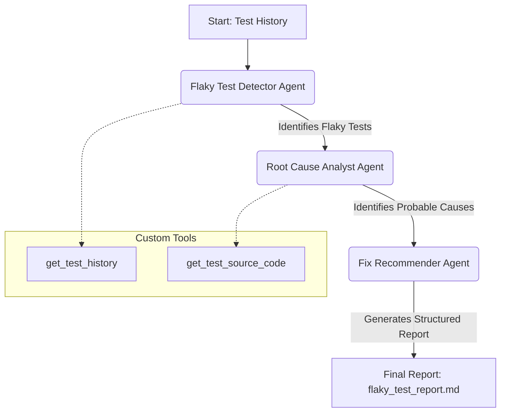
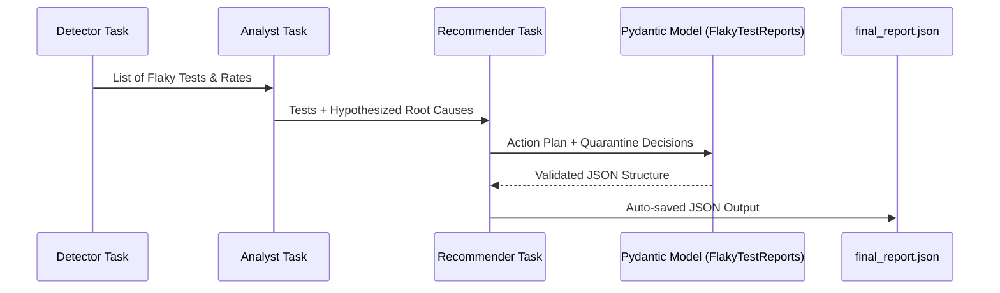

# 🧪 Flaky Test Investigator Crew

An AI-powered system built with **CrewAI** and **Groq** to automatically detect, analyze, and recommend fixes for flaky tests in your CI/CD pipelines.

---

## 🏗 System Architecture

### 🔄 Workflow Diagram
The following diagram illustrates the sequential workflow of the three specialized agents:



### 🧬 Data Lifecycle (Sequence Diagram)
How data flows between the Pydantic models and tasks:



---

## 🤖 The Crew

### 1. **Flaky Test Detector**
- **Role:** CI/CD Reliability Expert
- **Goal:** Identifies tests that have both passes and failures in the last 10 runs.
- **Tool:** `get_test_history`

### 2. **Root Cause Analyst**
- **Role:** Debugging Specialist
- **Goal:** Analyzes source code for timing issues, shared state, or environment dependencies.
- **Tool:** `get_test_source_code`

### 3. **Fix Recommender**
- **Role:** Senior SDET
- **Goal:** Provides actionable stabilization steps and quarantine recommendations in JSON format.
- **Constraint:** Enforced structured output via `output_json`.

---

## 🚀 How to Run the Project

### 1. **Prerequisites**
- Python 3.10+
- A [Groq API Key](https://console.groq.com/)

### 2. **Installation**
Clone the repository and install dependencies:
```bash
pip install crewai pydantic python-dotenv
```

### 3. **Configuration**
Create a `.env` file in the root directory and add your Groq API key:
```env
GROQ_API_KEY=your_actual_key_here
```

### 4. **Execution**
Run the main crew script:
```bash
python crew.py
```
Upon completion, the system automatically generates:
- **`final_report.json`**: A clean, structured JSON result of the entire investigation.
- **Console Log**: Detailed step-by-step reasoning from the agents.

---

## 🧪 Testing the Investigators

We've included unit tests to ensure all components are configured correctly.

- **Run Agent Configuration Tests:**
  ```bash
  pytest test_the_agents.py
  ```

- **Run Custom Tool Tests:**
  ```bash
  pytest test_the_tools.py
  ```

---

## 📜 Key Files
- `crew.py`: The entry point that assembles the crew and saves JSON results.
- `agents.py`: Definition of AI agents and their personas.
- `tasks.py`: Structured task definitions with `output_json` constraints.
- `tools.py`: Implementation of custom tools for test history and source code retrieval.
- `models.py`: Pydantic models (`FlakyTestReport`, `FlakyTestReports`) for structured output.

---
_Built with ❤️ for pipeline stability._
